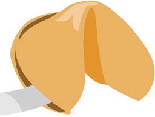
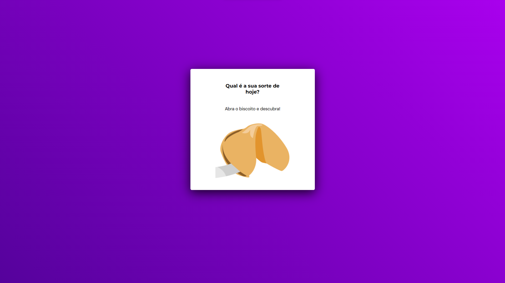

<h1 align="center"> Fortune Cookie </h1>

Project dedicated to focus in Study and Work

  <a href="#-tecnologias">Technologies</a>&nbsp;&nbsp;&nbsp;|&nbsp;&nbsp;&nbsp;
  <a href="#-projeto">Project</a>&nbsp;&nbsp;&nbsp;|&nbsp;&nbsp;&nbsp;
  <a href="#-links">Live Site</a>&nbsp;&nbsp;&nbsp;|&nbsp;&nbsp;&nbsp;

    

 

## 📚 Users can be:

- click on cookie
- back to first page
- look your luck

  
## 🚀 Technologies

This project was developed with the following technologies:

- HTML Semantic
- CSS
- CSSAnimation
- Manipulation of DOM
- JavaScript (array, Math, Functions)

## 💻 Project

In this project I practiced more about javascript and its array, I managed to learn more about how to manipulate the DOM.

## 📲 Links

- Live Site URL:
